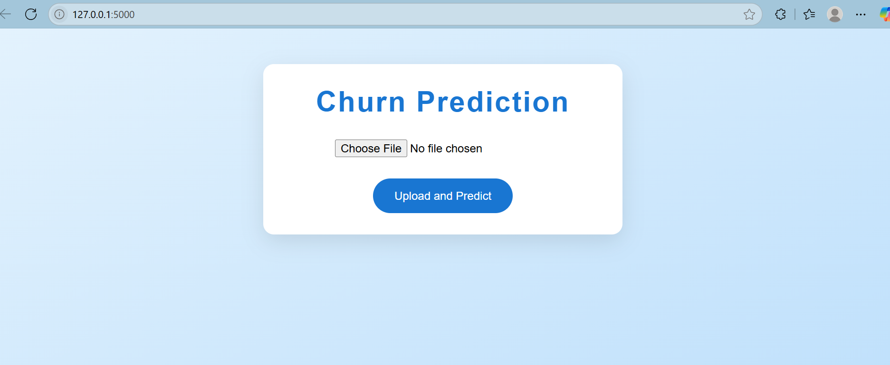

# Dynamic-Churn-Prediction-Model
Random Forest–based churn prediction app for Excel data (Flask + Python)

# 🔍 Dynamic Churn Prediction Model

A web-based churn prediction system that uses a **Random Forest classifier** to analyze customer data and predict churn. Built with Python and Flask, this app helps businesses quickly identify which customers are at risk of leaving — using just an Excel upload.

---

## 🖥️ Demo Preview

## 🖼️ Screenshots

### 🔸 Upload Page  


### 🔸 Prediction Results  


---

## 🛠️ Tech Stack

- **Backend:** Flask, Python  
- **ML Model:** Random Forest Classifier (Scikit-learn)  
- **Data Handling:** Pandas, NumPy  
- **Excel Support:** openpyxl / xlrd  
- **Frontend:** HTML/CSS (Basic)

---

## 📂 Features

- 📥 Upload Excel files with customer data  
- ✅ Auto-cleaning & preprocessing  
- 🔍 Predict churn using a trained ML model  
- 📊 View prediction results in the browser  

> ⚠️ The uploaded Excel file **must contain a column named `Churn`** (with values like Yes/No or 1/0).

---

## 🚀 How to Run Locally

1. **Clone this repository**
```bash
git clone https://github.com/your-username/dynamic-churn-predictor.git
cd dynamic-churn-predictor
